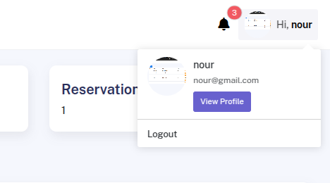
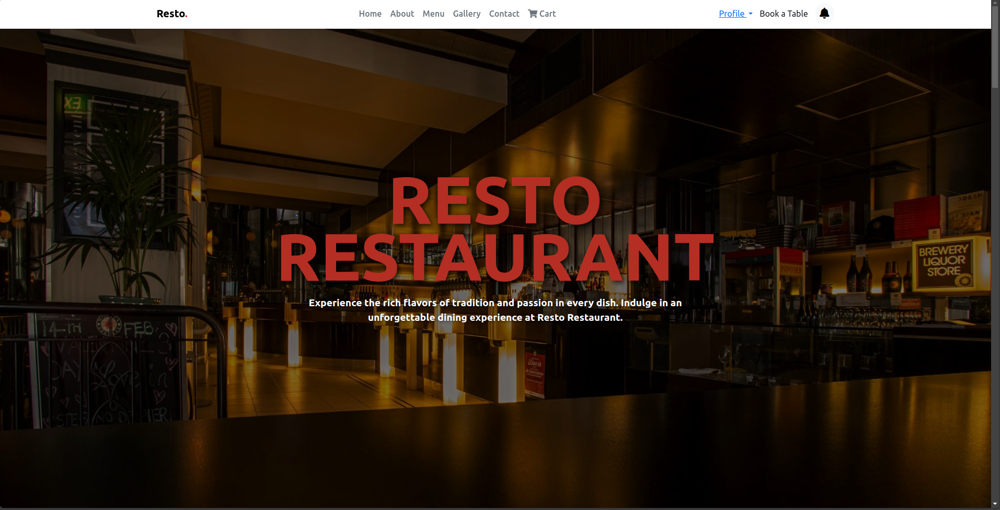

# Restaurant Management System   

Welcome to the **Resto** a **Restaurant Management System**, a comprehensive web-based solution designed to streamline restaurant operations. 

---

## 1. Project Structure 

The **Restaurant Management System** is organized into a modular structure to ensure scalability, maintainability, and ease of development. Below is the **detailed breakdown** of the project structure:

### Root Directory
```
restaurant-app/
├── .git/                     # Git version control files
├── admin/                    # Administrative backend
│   ├── categories.php        # Manage menu categories
│   ├── dashboard.php         # Admin dashboard
│   ├── inventory.php         # Inventory management
│   ├── manage_menu.php       # Manage menu items
│   ├── manage_orders.php     # Manage customer orders
│   ├── manage_reservations.php # Manage table reservations
│   ├── manage_users.php      # Manage users (staff/customers)
│   ├── profile.php           # Admin profile management
│   ├── supplier.php          # Supplier management
│   └── layout/               # Special offer management
│       ├── edit-offer.php    # Edit special offers
│       └── special-offer.php # Manage special offers
├── assets/                   # Static assets (CSS, JS, images)
│   ├── admin/                # Admin panel assets
│   │   ├── css/              # Admin CSS files
│   │   ├── fonts/            # Admin fonts
│   │   ├── img/              # Admin images
│   │   └── js/               # Admin JavaScript files
│   └── customer/             # Customer-facing assets
│       ├── css/              # Customer CSS files
│       ├── images/           # Customer images
│       ├── js/               # Customer JavaScript files
│       └── menu.json         # Menu data for customer website
├── database/                 # Database schema and sample data
│   ├── create_user.sql       # SQL script to create user table
│   ├── dummy.sql             # Sample data for testing
│   ├── sample_data.sql       # Additional sample data
│   └── schema.sql            # Database schema
├── functions/                # PHP functions
│   ├── add_user.php          # Add a new user
│   ├── edit_user.php         # Edit user details
│   ├── fetch_notifications_admin.php # Fetch admin notifications
│   ├── fetch_notifications_user.php # Fetch user notifications
│   ├── mark_all_notifications_read.php # Mark notifications as read
│   └── stats.php             # Generate statistics
├── handlers/                 # Form handling and business logic
│   ├── admin/                # Admin handlers
│   │   ├── cart-handler.php  # Handle cart operations
│   │   ├── categories.php    # Handle category operations
│   │   ├── checkout-handler.php # Handle checkout operations
│   │   ├── delete-offer-handler.php # Handle special offer deletion
│   │   ├── edit-offer-handler.php # Handle special offer editing
│   │   ├── forgot-password.php # Handle password recovery
│   │   ├── order_details.php # Handle order details
│   │   ├── reorder_handler.php # Handle reordering
│   │   ├── reservation.php   # Handle reservations
│   │   ├── reset-password.php # Handle password reset
│   │   ├── special-offer.php # Handle special offers
│   │   └── update_order_status.php # Update order status
│   ├── common/               # Common handlers
│   │   ├── auth_handler.php  # Handle authentication
│   │   ├── logout.php        # Handle user logout
│   │   ├── profile_handler.php # Handle profile updates
│   │   └── register_handler.php # Handle user registration
│   └── customer/             # Customer handlers
│       └── reservation.php   # Handle customer reservations
├── includes/                 # Reusable PHP code snippets
│   ├── admin/                # Admin includes
│   │   ├── footer.php        # Admin footer
│   │   ├── header.php        # Admin header
│   │   └── sidebar.php       # Admin sidebar
│   ├── common/               # Common includes
│   │   ├── Database.php      # Database connection
│   │   ├── Functions.php     # Common functions
│   │   └── validations.php   # Input validation
│   └── customer/             # Customer includes
│       ├── footer.php        # Customer footer
│       ├── header.php        # Customer header
│       └── nav.php           # Customer navigation
├── cart.php                  # Shopping cart functionality
├── composer.json             # Composer configuration
├── composer.lock             # Composer lock file
├── forgot-password.php       # Forgot password page
├── index.php                 # Customer-facing website entry point
├── init.php                  # Initialization file
├── login.php                 # Login page
├── node_modules/             # Node.js dependencies
└── README.md                 # Project overview and instructions
```

---

## 2. Technologies Used 🛠️  

The **Restaurant Management System** leverages a variety of technologies to ensure a robust, scalable, and user-friendly application. Below is a **detailed list** of the technologies used:

### Backend
- **PHP**: The core server-side scripting language used for backend logic.
- **MySQL**: The relational database management system for storing application data.
- **Composer**: A dependency manager for PHP, used to manage libraries and packages.
- **PHPMailer**: A library for sending email notifications (e.g., password reset, order confirmation).

### Frontend
- **HTML5**: The standard markup language for creating web pages.
- **CSS3**: Used for styling the application and ensuring a responsive design.
- **JavaScript**: Adds interactivity and dynamic behavior to the application.
- **Bootstrap 5**: A frontend framework for building responsive and mobile-first websites.
- **FontAwesome**: A library of icons used throughout the application.
- **SweetAlert2**: A JavaScript library for beautiful and customizable alerts.
- **Chart.js**: Used for generating sales reports and visualizations.
- **AJAX**: Used for asynchronous data fetching and updating the UI without reloading the page.

---

## 3. Features  

The **Restaurant Management System** is packed with features to help restaurant owners and staff manage their operations efficiently. Below is a **detailed breakdown** of the features:

### User Management
- **Role-Based Access Control**: 
  - Staff and administrators have different levels of access.
  - Admins can manage users, update roles, and delete accounts.
- **User Profiles**:
  - Users can update their profile information, including name, email, and profile picture.
  - Password management with secure hashing and validation.
- **Email Verification**:
  - Users receive a verification email upon registration.
  - Email verification is required to activate the account.
- **Password Recovery**:
  - Users can reset their password via email if they forget it.

### Menu Management
- **Menu Categories**:
  - Add, edit, and delete menu categories (e.g., Appetizers, Main Course, Desserts).
- **Menu Items**:
  - Add, edit, and delete menu items with details like name, description, price, and image.
  - Set availability status for each item.
- **Special Offers**:
  - Create and manage special offers with discount types (percentage or fixed) and validity dates.
  - Automatically apply discounts to menu items during checkout.

### Inventory Management
- **Stock Tracking**:
  - Track inventory levels for each item.
  - Set reorder thresholds to receive alerts when stock is low.
- **Add/Delete Items**:
  - Add new items to the inventory or delete outdated items.
- **Low Stock Notifications**:
  - Staff receive notifications when inventory items fall below the reorder threshold.

### Order Management
- **Order Placement**:
  - Customers can place orders through the menu interface.
  - Orders are stored in the database with details like total price, status, and payment method.
- **Order Tracking**:
  - Customers can track the status of their orders (e.g., Pending, Preparing, Delivered).
- **Payment Processing**:
  - Integrated with Stripe for secure online payments.
  - Support for cash on delivery.
- **Order History**:
  - Customers can view their past orders and reorder items.

### Reservation Management
- **Reservation Booking**:
  - Customers can book tables by providing details like date, time, and number of guests.
- **Reservation Status**:
  - Staff can confirm or cancel reservations through the dashboard.
  - Real-time updates on reservation status.
- **Reservation History**:
  - Customers can view their past reservations.

### Dashboard & Reports
- **Key Metrics**:
  - View total sales, active orders, and upcoming reservations on the dashboard.
- **Sales Reports**:
  - Generate detailed sales reports filtered by date range.
  - Export reports in CSV or PDF format.
- **Inventory Reports**:
  - Generate reports on inventory levels and low-stock items.

### Notifications
- **Low Stock Alerts**:
  - Receive notifications when inventory items fall below the reorder threshold.
- **Order Updates**:
  - Customers receive notifications when their order status changes.
- **Reservation Updates**:
  - Customers receive notifications when their reservation status changes.

---

## 4. Examples and Use Cases  

Below are **detailed examples and use cases** to help you understand how to use the **Restaurant Management System** effectively:

### Example 1: Adding a New Menu Item
1. **Navigate to Menu Management**:
   - Go to the "Menu Management" section in the staff dashboard.
2. **Add a New Item**:
   - Fill in the form with details like name, description, price, and category.
   - Upload an image for the menu item.
3. **Save the Item**:
   - Click "Add Item" to save the new menu item to the database.
4. **Set Availability**:
   - Toggle the availability status to make the item visible to customers.

### Example 2: Placing an Order
1. **Browse the Menu**:
   - Customers can browse the menu and add items to their cart.
2. **Checkout**:
   - Proceed to checkout and provide payment details (credit card or cash on delivery).
3. **Order Confirmation**:
   - After successful payment, the order is confirmed, and the customer receives a notification.
4. **Track Order**:
   - Customers can track the status of their order in real-time.

### Example 3: Managing Reservations
1. **Book a Table**:
   - Customers can book a table by selecting a date, time, and number of guests.
2. **Confirm Reservation**:
   - Staff can confirm the reservation from the dashboard.
3. **Cancel Reservation**:
   - If needed, staff can cancel the reservation, and the customer will be notified.
4. **View Reservation History**:
   - Customers can view their past reservations and rebook tables.

### Example 4: Generating Sales Reports
1. **Filter by Date Range**:
   - Select a start and end date to filter sales data.
2. **Generate Report**:
   - Click "Generate Report" to view the sales data.
3. **Export Report**:
   - Export the report in CSV or PDF format for further analysis.
4. **View Key Metrics**:
   - View total sales, active orders, and upcoming reservations on the dashboard.

### Example 5: Managing Inventory
1. **Add New Item**:
   - Go to the "Inventory Management" section and add a new item with details like name, quantity, and reorder threshold.
2. **Track Stock Levels**:
   - Monitor stock levels and receive notifications when items fall below the reorder threshold.
3. **Delete Outdated Items**:
   - Remove outdated items from the inventory to keep it up-to-date.

---

## 5. Screenshots 📸  

Below are screenshots of the **Restaurant Management System** to give you a visual overview of its features and user interface:

### **Admin Features**

#### **Admin Dashboard**
  
*The admin dashboard provides an overview of key metrics such as total sales, total orders, active orders, and upcoming reservations.*

#### **Menu Management**
  
  
  
  
*Admins can add, edit, or delete menu items and categories, set availability status, and create special offers.*

#### **Order Management**
  
  
*Admins can view and manage all orders, update order status in real-time (e.g., Pending, Preparing, Ready, Delivered), and view detailed order information.*

#### **Reservation Management**
  
  
*Admins can view and manage all reservations, including confirming, modifying, or canceling reservations.*

#### **Inventory Management**
  
*Admins can track inventory levels, set reorder thresholds, and receive low-stock alerts.*

#### **Supplier Management**
  
*Admins can add, edit, and delete supplier information and track supplier orders.*

#### **User Management**
  
*Admins can manage user accounts, including adding, editing, or deleting users and assigning roles.*

#### **Notifications**
  
*Admins can view and manage system notifications, such as low-stock alerts or new order notifications.*

#### **Profile Management**
  
  
*Admins can update their profile information, change passwords, and manage account settings.*

---

### **Customer Features**

#### **Home Page**
  
*The customer home page provides an overview of the restaurant, including featured menu items and promotions.*

#### **Menu Browsing**
  
*Customers can browse the menu by categories and search for specific items.*

#### **Cart**
  
*Customers can view and manage items in their cart before placing an order.*

#### **Order Placement**
  
*Customers can view detailed information about their orders, including item breakdown and order status.*

#### **Order History**
  
*Customers can view their past orders and reorder items.*

#### **Reservation Booking**
  
*Customers can book tables by selecting a date, time, and number of guests.*

#### **Profile Management**
  
*Customers can update their profile information and manage account settings.*

#### **About Us**
  
*Customers can learn more about the restaurant, including its history and mission.*

---

### **Authentication**

#### **Login**
  
*Users can log in to their accounts using their credentials.*

#### **Register**
  
*New users can create an account by providing their details.*

#### **Forgot Password**
  
*Users can reset their password by providing their email address.*
